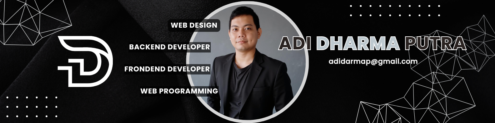

<!-- Modern GitHub Profile README for Adi with Laravel, Next.js & WordPress focus -->

<h1 align="center">Hi 👋, I'm Adi</h1>
<h3 align="center">Full Stack Developer | Laravel • Next.js • WordPress</h3>

  

---

## 🚀 About Me

I'm a passionate developer from **Sidoarjo, Indonesia 🇮🇩**  
Specializing in modern full-stack development using **Laravel**, **Next.js**, and **WordPress** to build clean, scalable, and high-performance web applications.

- 💼 1 years experience in Web Development
- 🔭 Currently building dynamic apps with **Laravel Livewire**
- ⚙️ Exploring the power of **Next.js** for frontend and hybrid apps
- 🛠️ Creating and managing websites with **WordPress**
- 📬 Reach me at: **adidarmap@gmail.com**

---

## 🛠️ Tech Stack & Tools

### ⚙️ Core Stack

### 🧠 Backend

### 🎨 Frontend

### 🛠️ Tools

---

## 📈 GitHub Stats

  
   
  
   
  

---

## 🔗 Let's Connect
  
  

---

## 🔍 Featured Projects

- 🎯 [Inventory System Laravel](https://github.com/adidarma24/inventory-system) – Inventory management app built with Laravel 12
- 💼 [Next.js Portfolio](https://github.com/adidarma24/nextjs-portfolio) – Developer portfolio using Next.js + TailwindCSS
- 📝 [WordPress Company Website](https://github.com/adidarma24/wp-company) – Business site template with Elementor + ACF

---

## 🐍 GitHub Activity Snake

  

<!-- Powered by ChatGPT x Adi Dharma -->
